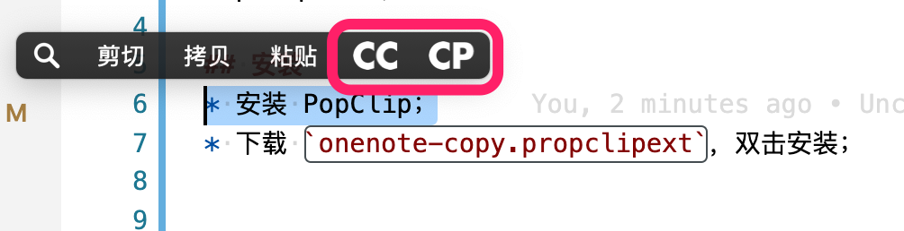
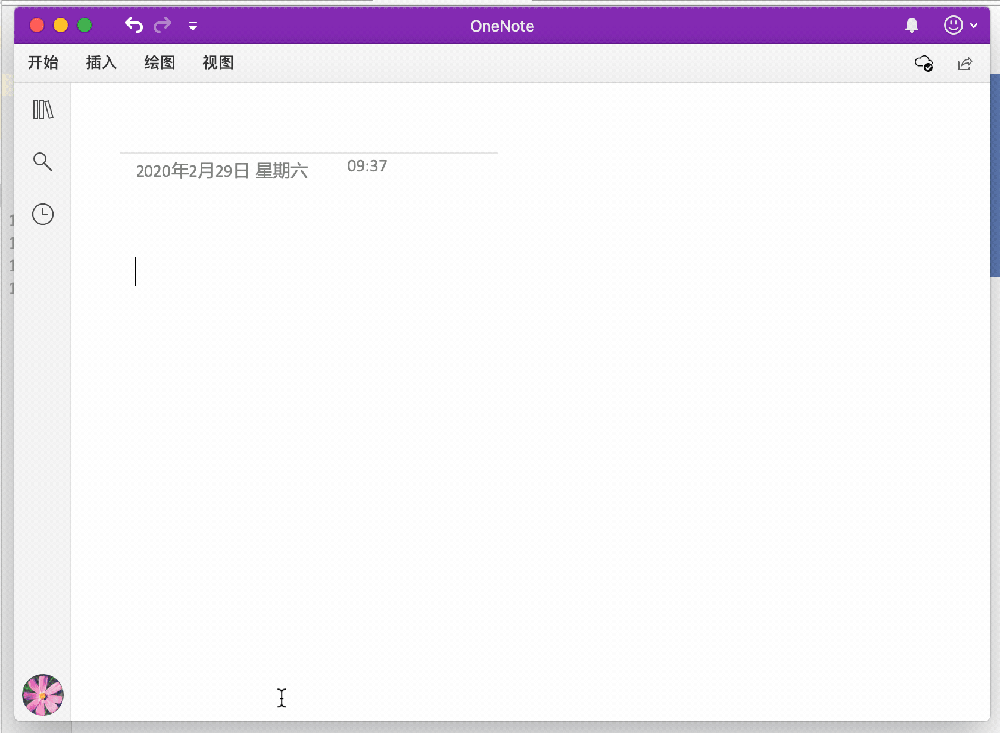

# PopClip-CodeCopy2Onenote

PopClip 扩展，用于方便onenote中粘贴代码，解决复制到onenote后空格消失问题；

## 安装
* 安装 PopClip；
* 下载 `onenote-copy.propclipext`，双击安装；

## 用法
界面如下：    

操作示意：
    

提供两个功能，分别做以下用途：
* 【CC】复制纯文本
* 【CP】复制纯文本，粘贴覆盖当前选中内容

### 【CC】复制纯文本
* 选中文本，点击 `CC`;
* 提示已复制后粘贴到 onenote

### 【CP】复制纯文本并粘贴（IDE或者编辑器中使用）
* 选中文本，点击 `CP`;
* 扩展会自动处理其中的空格后将结果粘贴到当前编辑器中；
* 选中粘贴回来的内容，手动复制，然后撤销；
* 复制到onenote；

